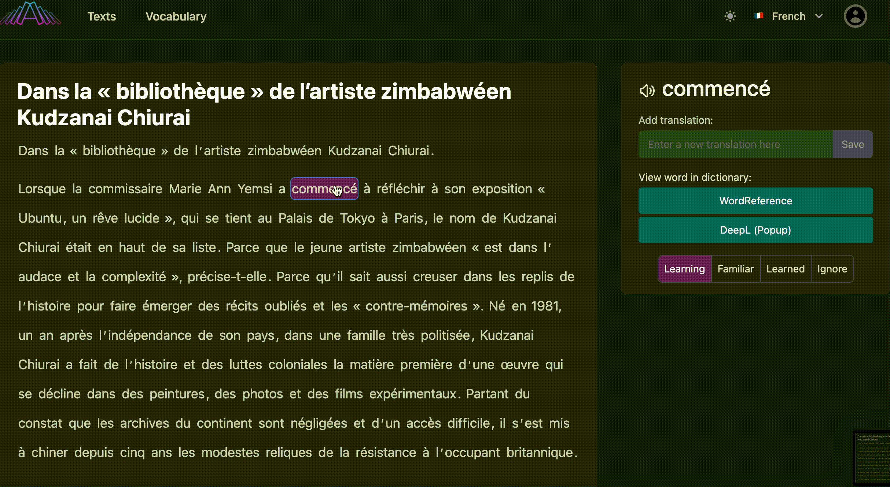

Alexandria is an open source language learning app that allows users learn languages using text.

Read about how we made it [here](https://alexandria-reader.github.io/).

Alexandria is accessible [here](https://tryalexandria.com/).

# Running Alexandria locally for development

First clone both this repo and the [backend](https://github.com/alexandria-reader/backend).
Run `npm install` to install the dependencies, then add a .`env` file to the root directory with the values from `.env.sample`.
Then run `npm run dev`.

Now that the frontend is started, follow the getting started instructions in the backend `README.md`.

## Features Highlight

### Add translation for selected words

### Phrase selection

### Light and dark modes

